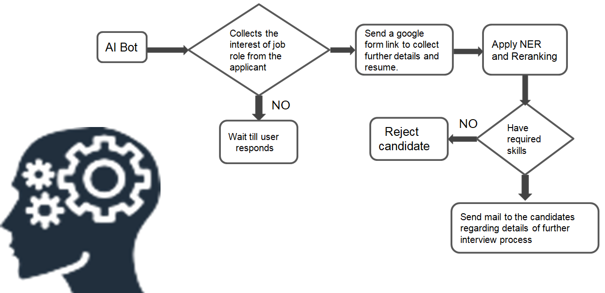
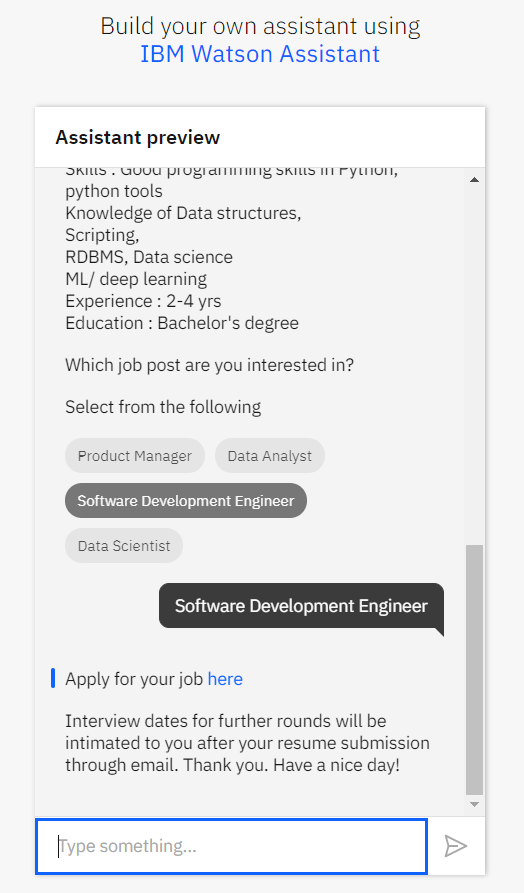

<h1><strong>AI Recruiter: Bias-free Shortlist a Suitable candidate for specific Job Role</strong></h1>

AI recruiting is a subset of recruiting automation and aims at the exact same thing —  streamlining your recruiting efforts. But as traditional automation has limitations in terms of understanding natural language, analyzing large amounts of complex, unstructured data and finding patterns on its own, that’s where AI excels.

Our proposed model will perform a fair shortlisting(no bias towards gender, age, or race) to achieve ‘equal opportunity’ and ‘demographic parity’ depending on the choice of the desired distribution over protected attributes like gender, race, and age, etc.
A classic example of this is Amazon’s AI recruitment system. The company was trying out this system to shortlist candidates automatically for certain unfilled positions. The team working on the tool found out that the tool was biased against female candidates because the previous 10 years’ data fed into the system had a pattern of subconscious/unconscious bias against females. The algorithm had no idea it was supposed to ignore it.

<h5><strong>Technology Stack:</strong></h5>
<ul>
  <li>Python3</li>
  <li>NLP</li>
  <li>spaCy: For resume summarization</li>
  <li>PyPDF2: Working with Resumes</li>
   <li>
IBM Watson Assistant for Chatbot creation</li>
</ul>

<h3>Link to ChatBot </h3>
https://web-chat.global.assistant.watson.cloud.ibm.com/preview.html?region=eu-gb&integrationID=b0a898a5-70be-4a5d-8a03-f7be283f1244&serviceInstanceID=bd0f4fff-d0f8-4643-b762-12a1d8dc7c1b

<h3>Link to Demonstration Video</h3>
https://drive.google.com/file/d/1yxleHLJfujVlCmqVNqQgoAJYcTsdy4PK/view?usp=sharing

<h2>Block Diagram</h2>

  
<h2>Screenshots And Results</h2>
<h3> 1. Chatbot Preview</h3>

 

 
<h3> 2. Form For Collecting Resumes And Other Information</h3>

 
<h3> 3. Graph After Parsing Candidates Resumes</h3>

 
<h3> 4. CSV File After Computing Scores</h3>

 
<h3> 5. Re-ranking Algorithms Comparision</h3>

 
<h3> 6. E-mail To Top Candidates</h3>

 
